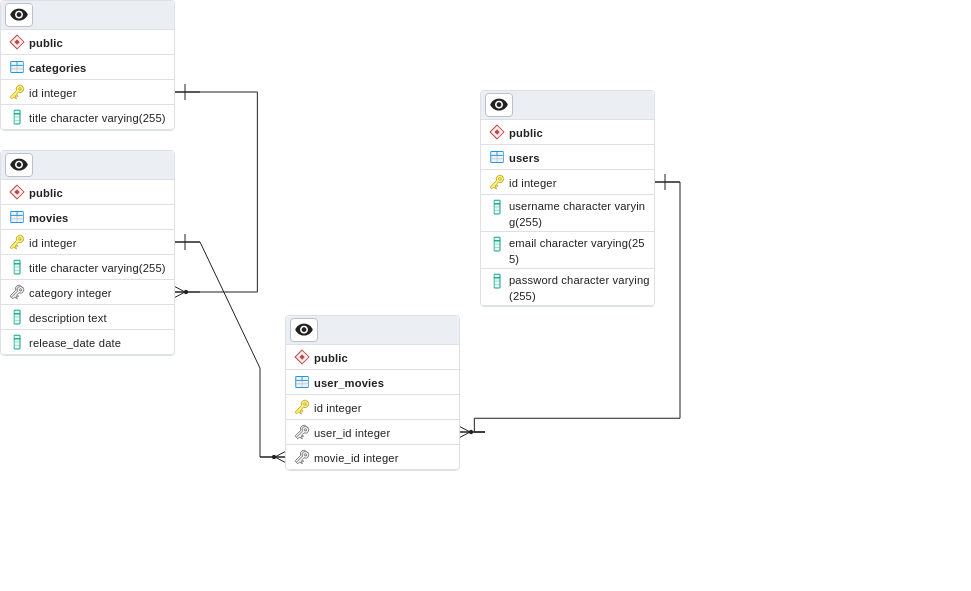

# Prueba técnica [desarrollador backend]

Esta aplicación consiste en una API REST que gestiona datos entre usuarios, películas y sus correspondientes categorías. La aplicatión esta desarrollada en **Typescript** usando el framework **Express.js** y utiliza **PostsgreSQL** como base de datos. Para realizar las conexiones con la base de datos se utilizo la libreria **pg**. Tambien se utilizaron bibliotecas como **bcryptjs** para encriptar las contraseñas de los usuarios, **jsonwebtoken** para lidiar con la autorizacion de los usuarios y **express-validator** para lidiar con los formularios para añadir elementos en la base de datos.

El proyecto utiliza **MVC** (Modelo-Vista-Controlador) como el modelo de arquitectura al desarrollar esta prueba tecnica. En la carpeta de [/database](./src/database) se encuentran todos los script SQL utilizados por la aplicación. En la carpeta [/services](./src/services) se encuentran acoplados todas las funciones que utilizan esos queries para realizar peticiones a la base de datos.

## Enlaces a demo de la aplicación

- La API se encuentra desplegada en el siguiente enlace: <todo:>

- La documentacion sobre cada una de las distintas rutas la pueden encontrar <aca:>

Si se desea montar la aplicacioń en local solo es necesario copiar este repositorio. Asegurarse de poseer Node.js, en lo posible una versión de 18 para arriba y crear un archivo _.env_ donde almacenar las distintas variables de entorno. Se puede utilizar el esquema de este archivo ubicado [aca](/.example.env)

# CUESTIONARIO

## 1. ¿Cuál es el propósito de "module.exports"?

## 2. ¿Qué es un middleware?

## 3. ¿Cual es la diferencia entre código bloqueante y código no bloqueante?

## 4. ¿Qué biblioteca de javascript usaría para manejar datos en tiempo real?

# PLUS

## 5. ¿Cual es la principal ventaja de trabajar un proyecto dockerizado?

## 6. ¿Cual es la diferencia entre una imagen y un volumen en Docker?

## 7. ¿Con qué herramienta se puede orquestar un proyecto con múltiples imágenes en Docker?

## 8. ¿Cual es la principal ventaja de trabajar con cluster de kubernetes?
